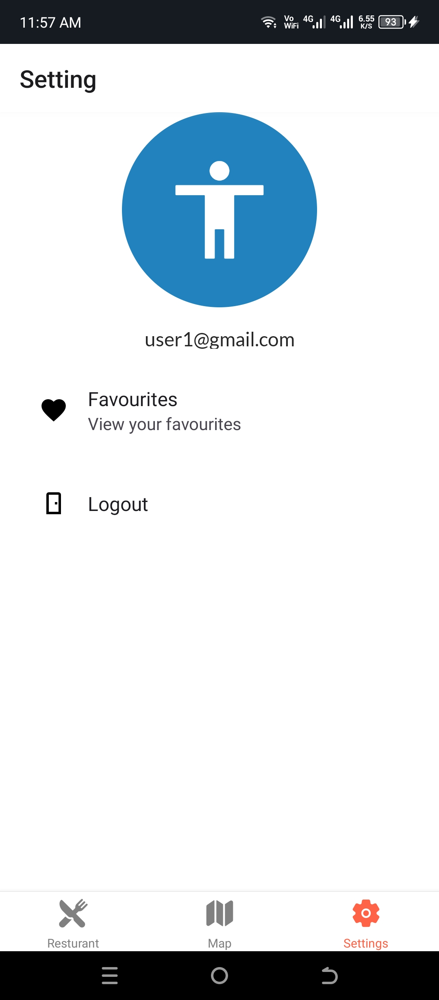
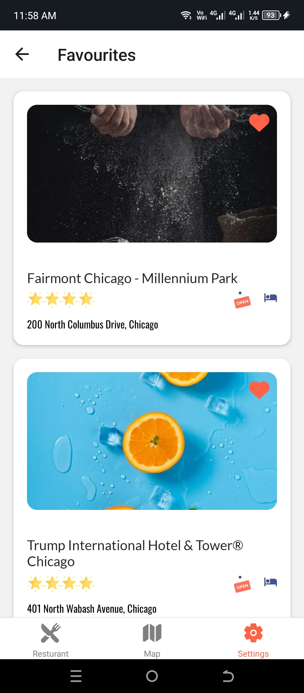
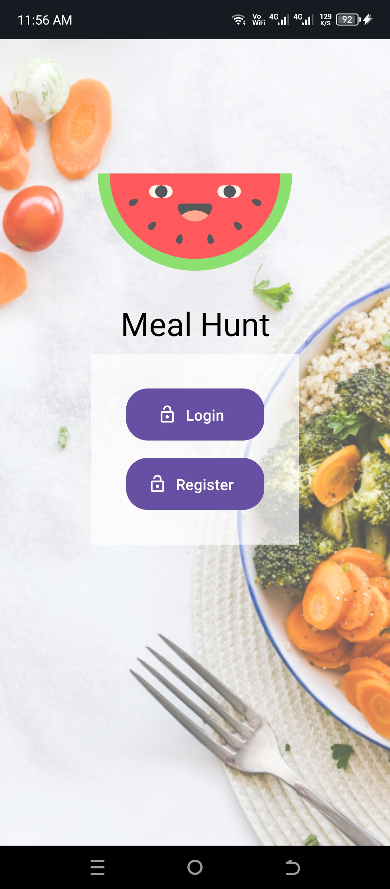
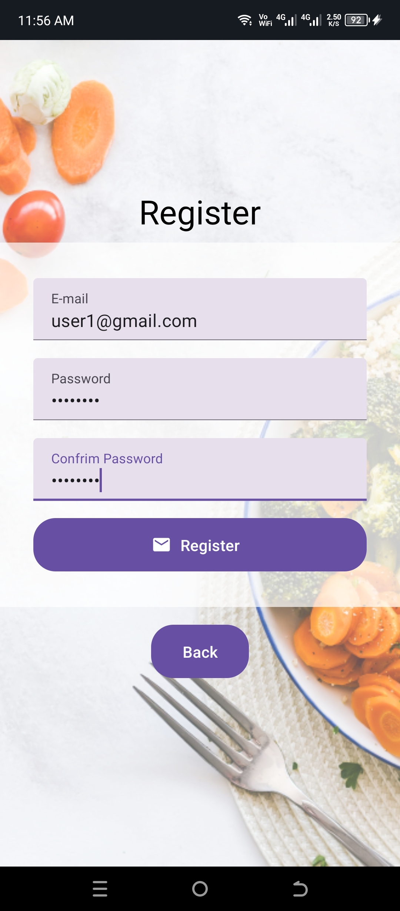
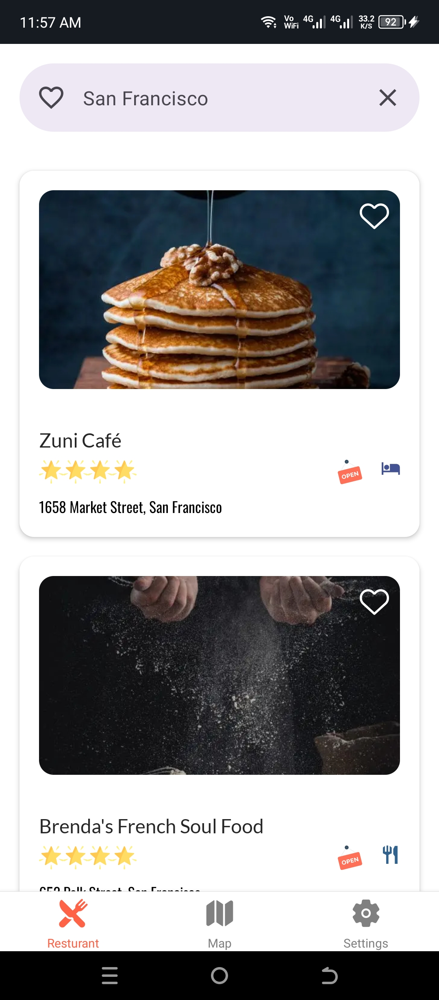
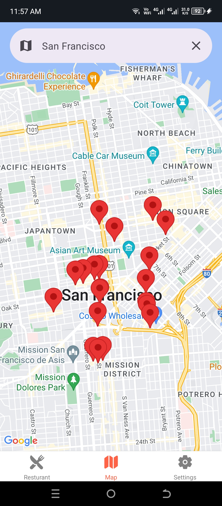

# Meal Hunt (Mobile App)

This is a **React Native** application built with **Expo** that allows users to search for cities in the USA and explore restaurants in the searched city. Users can add restaurants to their favorites and remove them from favorites. The app includes **Firebase Authentication** for user login and signup, and utilizes **styled-components** for styling.

---

## Features

- **Search Restaurants by City:** Search for restaurants in any city in the USA.
- **Favorite Restaurants:** Add restaurants to your favorites and manage your favorite list.
- **User Authentication:** Sign up and log in using Firebase Authentication.
- **Beautiful UI:** Styled using styled-components for a modern and cohesive look.

---

## Screen Shots

<table> 
<tr>
  <td></td> 
  <td></td> 
  <td></td> 
</tr>
<tr>
  <td></td> 
  <td></td> 
  <td></td> 
</tr> 
</table>

---

## Tech Stack

- **React Native** with Expo
- **Firebase Authentication**
- **Styled-Components** for styling

---

## Getting Started

Follow these steps to get the project up and running on your local machine:

### Prerequisites

- Node.js and npm installed.
- Expo CLI installed globally.

### Installation

1. Clone the repository:

   ```bash
   https://github.com/UzairKhan313/react-native-meal-hunt.git
   cd react-native-meal-hunt
   ```

2. Install dependencies:

   ```bash
   npm install
   ```

3. Set up Firebase:

   - Go to [Firebase Console](https://console.firebase.google.com/).
   - Create a new project.
   - Enable Email/Password authentication under **Authentication > Sign-in Method**.
   - Copy your Firebase configuration.
   - Replace the Firebase configuration in the `firebase.js` file:

     ```javascript
     import { initializeApp } from "firebase/app";

     const firebaseConfig = {
       apiKey: "YOUR_API_KEY",
       authDomain: "YOUR_AUTH_DOMAIN",
       projectId: "YOUR_PROJECT_ID",
       storageBucket: "YOUR_STORAGE_BUCKET",
       messagingSenderId: "YOUR_MESSAGING_SENDER_ID",
       appId: "YOUR_APP_ID",
     };

     const app = initializeApp(firebaseConfig);
     ```

4. Run the app:

   ```bash
   expo start
   ```

5. Open the app on an emulator or your device:

   - Scan the QR code using the Expo Go app (iOS or Android).

---

## Project Structure

```plaintext
├── App.js                  // Main entry point
├── firebase.js             // Firebase configuration
├── components/             // Reusable components
├── screens/                // Application screens
├── navigation/             // Navigation setup
├── styles/                 // Styled-components setup
└── assets/                 // Static assets (images, icons, etc.)
```

---

## Features in Detail

### 1. Search Functionality

- Search for cities across the USA.
- Displays a list of restaurants in the searched city.

### 2. Favorites Management

- Add restaurants to your favorites list.
- Remove restaurants from favorites.
- Persist favorites locally for each user.

### 3. Authentication

- User registration and login powered by Firebase Authentication.
- Authentication state management for seamless user experience.

---

## Dependencies

- **React Native**
- **Expo**
- **Firebase**
- **Styled-Components**

---

## Contributing

Contributions are welcome! To contribute:

1. Fork the repository.
2. Create a new branch:

   ```bash
   git checkout -b feature-name
   ```

3. Commit your changes:

   ```bash
   git commit -m "Add feature-name"
   ```

4. Push to the branch:

   ```bash
   git push origin feature-name
   ```

5. Open a pull request.

---

## License

This project is licensed under the [MIT License](LICENSE).

---

## Contact me

Email: [uzairkhaan2003@gmail.com](mailto:uzairkhaan2003@gmail.com)

Happy Coding! 🚀
